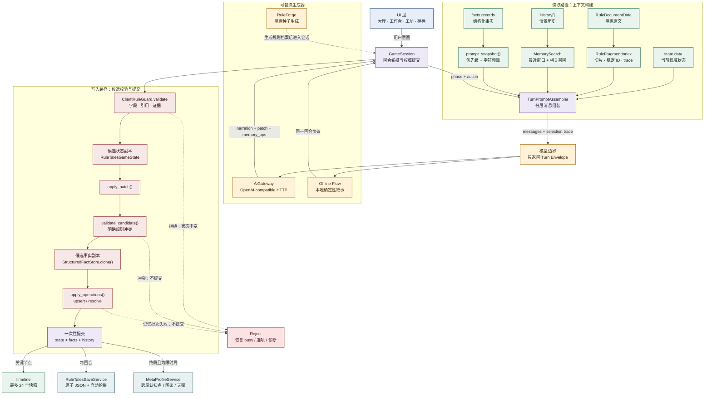
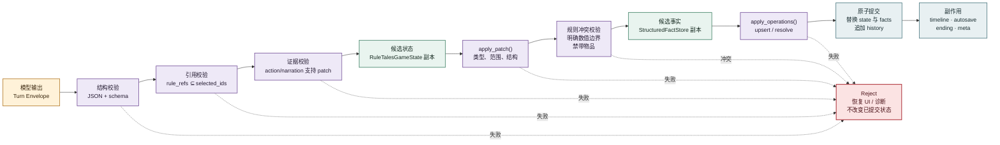

# 异闻夜谈 · Godot

一个以规则怪谈为载体的 AI 交互叙事项目，也是一套可以抽取到其他 AI 应用中的**长期记忆、上下文组装与客户端权威状态架构**。

项目不把每轮对话简单地拼接到下一轮提示词中，而是将长期信息拆成不同职责的记忆层：

- **权威状态（Working State）**：当前时间、天气、数值、背包、地图、人物状态和结局。
- **结构化事实（Structured Facts）**：线索、人物、地点、已触发规则和未解决事件。
- **情景历史（Episodic History）**：完整对话记录，以及按查询召回的较早相关历史。
- **语义规则索引（Semantic Rule Index）**：规则文档切片、稳定 ID、相关规则和全局规则。
- **时间线快照（Timeline Checkpoints）**：关键节点、可回顾历史和可恢复的状态分支。
- **跨局元记忆（Meta Profile）**：认知点、图鉴、异常发现和解锁天赋。

AI 只负责生成叙事和候选操作；客户端负责记忆写入、状态校验、规则冲突裁判、事务提交和持久化。这个边界使系统既能保留长期上下文，又不会把最终状态交给模型自由修改。

> 本项目当前是一个完整的 Godot 游戏工程，不是已经打包发布的通用 SDK。它的可复用价值在于：长期记忆的数据模型、上下文检索策略、结构化输出契约、事务式提交流程和持久化边界都已经在真实交互场景中实现。

## 设计目标

### 1. 让长期记忆可验证

对话历史适合保留原始叙事，但不适合作为唯一事实来源。项目将“发生过什么”与“当前是什么”分开保存：

- 当前状态只接受经过 schema 校验的状态补丁。
- 长期事实使用稳定 ID，并区分 `active` 与 `resolved`。
- 历史记录可以被标记为“可能过时”，不能覆盖权威状态。
- 规则引用必须来自本回合实际检索到的规则片段。
- 事实、状态和规则引用在同一回合中一起校验，任一部分失败则整回合不提交。

### 2. 让上下文预算可控

每轮不发送完整规则和全部历史，而是按当前行动建立查询，分别召回：

- 最近对话窗口：保留局部叙事连续性。
- 相关历史：从更早记录中找出与当前行动相关的片段。
- 相关规则：从规则片段索引中召回有限条目。
- 全局规则：始终提供少量基础规则，避免模型失去全局约束。
- 结构化事实：按事件优先级和最近更新时间生成快照。

所有召回结果都带有可追踪的选择轨迹和字符预算，便于调试和替换检索算法。

### 3. 让 AI 成为可替换的叙事组件

AI 网关只处理 OpenAI 兼容的 HTTP 请求和响应解析，不拥有游戏状态。离线体验使用同一套回合提交管线，只替换叙事生成器，不改变状态、记忆和裁判协议。

因此可以替换：

- DeepSeek 或其他 OpenAI 兼容模型
- 本地模型服务
- 规则叙事模型
- 离线确定性叙事器
- 未来的向量检索或混合检索实现

而不必重写长期记忆和权威状态层。

## 总体架构



这张图刻意把**读取路径**和**写入路径**分开：读取路径只构建本轮上下文；写入路径必须经过候选副本和客户端裁判，最终才会更新权威对象。`RuleForge` 是开局生成器，不是每回合的模型提供方；`timeline` 和 `MetaProfileService` 也不是提示词读取源，而是提交成功后的持久化结果。

核心依赖方向是：

```text
UI -> GameSession -> Prompt / Gateway / Guard / Persistence
                         |
                         +-> State / Facts / History / Rules / Timeline
```

UI 只提交用户意图和展示信号，不直接修改权威状态。临时窗口关闭或重新创建时，核心会话、记忆和存档仍然独立存在。

## 回合数据流

一次行动从输入到提交的完整路径如下：

```mermaid
flowchart LR
    IN["输入<br/>玩家行动 + 当前会话"] --> Q["查询构建<br/>action · location · weather<br/>active facts · current state"]
    Q --> R1["规则召回<br/>global + relevant<br/>character budget"]
    Q --> R2["历史召回<br/>recent window + relevant history"]
    Q --> R3["事实快照<br/>open_event 优先<br/>active 优先 · last_updated_turn"]
    R1 --> M["TurnPromptAssembler<br/>system constraints + state + memory"]
    R2 --> M
    R3 --> M
    M --> OUT["Turn Envelope<br/>narration · choices · rule_refs<br/>memory_ops · patch"]

    OUT --> V1{ "结构校验<br/>JSON · 字段 · 类型" }
    V1 -- 失败 --> REJ["拒绝<br/>权威状态不变"]
    V1 -- 通过 --> V2{ "引用与证据<br/>rule_refs · action/narration" }
    V2 -- 失败 --> REJ
    V2 -- 通过 --> S["候选副本<br/>state.clone + facts.clone"]
    S --> P["应用候选变化<br/>apply_patch + apply_operations"]
    P --> V3{ "规则冲突校验<br/>数值边界 · 禁带物品<br/>地图/结局约束" }
    V3 -- 冲突 --> REJ
    V3 -- 通过 --> C["原子提交<br/>state + facts + history"]
    C --> T["时间线快照<br/>关键节点"]
    C --> A["自动存档<br/>临时文件校验后替换"]

    classDef input fill:#e8eef7,stroke:#42658a,color:#172538,stroke-width:1.5px;
    classDef retrieval fill:#e9f4ef,stroke:#3f8065,color:#172b22,stroke-width:1.5px;
    classDef context fill:#eee9f7,stroke:#76529a,color:#241b31,stroke-width:1.5px;
    classDef validation fill:#fff2d9,stroke:#b27827,color:#38250c,stroke-width:1.5px;
    classDef commit fill:#e8f0f2,stroke:#4c7880,color:#172a2e,stroke-width:1.5px;
    classDef reject fill:#fbe3e3,stroke:#b23b43,color:#4a1117,stroke-width:2px;
    class IN,Q input;
    class R1,R2,R3 retrieval;
    class M,OUT context;
    class V1,V2,V3,S,P validation;
    class C,T,A commit;
    class REJ reject;
```

图中的分叉只发生在**读取阶段**：规则、历史和事实分别召回，再汇合成一份带 trace 的提示词。模型输出后不允许直接写入任何持久对象，必须经过三道门：结构校验、引用/证据校验、候选状态的规则冲突校验。只有最后的原子提交成功，才会写入时间线和自动存档。

### 回合提交的关键不变量

1. 模型响应必须是一个结构化 JSON 回合对象。
2. `rule_refs` 只能引用本回合已经检索的规则 ID。
3. `memory_ops` 最多 8 项，只允许 `upsert` 和 `resolve`。
4. `resolve` 只能结案已经存在的 `open_event`。
5. 状态补丁只能使用公开字段，未知字段直接拒绝。
6. 背包和地图变化必须有行动或叙事证据。
7. 结局必须引用本回合实际使用的规则。
8. 状态和事实先写入候选副本，全部通过后才替换权威对象。
9. 请求取消、网络失败、JSON 损坏或裁判拒绝都不能污染已提交状态。

## 长期记忆模型

### 记忆分层

| 层         | 载体                     | 作用                             | 是否权威           |
| ---------- | ------------------------ | -------------------------------- | ------------------ |
| 当前状态   | `RuleTalesGameState`   | 时间、数值、背包、地图、结局     | 是                 |
| 结构化事实 | `StructuredFactStore`  | 线索、人物、地点、规则、开放事件 | 是                 |
| 情景历史   | `GameSession.history`  | 原始用户行动和模型叙事           | 否，历史可能过时   |
| 规则记忆   | `RuleFragmentIndex`    | 可引用的规则片段和稳定 ID        | 是，来源只读       |
| 时间线     | `GameSession.timeline` | 关键节点和可恢复快照             | 是，受会话规则约束 |
| 跨局记忆   | `MetaProfileService`   | 认知点、图鉴、异常和天赋         | 是，跨局持久化     |

### 结构化事实

`StructuredFactStore` 是长期记忆的核心写入层，支持以下事实类型：

```text
clue            线索
character       人物
location        地点
triggered_rule  已触发规则
open_event      未解决事件
```

每条事实包含：

```json
{
  "id": "event_archive_tampered",
  "kind": "open_event",
  "title": "档案被翻动过",
  "detail_bbcode": "某一页的内容与记忆不符。",
  "status": "active",
  "first_seen_turn": 4,
  "last_updated_turn": 4
}
```

事实写入具有以下特征：

- 稳定 ID 让模型可以在后续回合更新同一事实，而不是反复制造重复记录。
- `first_seen_turn` 和 `last_updated_turn` 保留事实生命周期。
- `open_event` 只能通过 `resolve` 进入 `resolved`，不会被普通更新隐式删除。
- 每次批量操作都先复制候选数组，全部通过后才替换 `records`。
- 最大事实数为 512，每回合最多 8 个操作，避免记忆无限膨胀。
- `prompt_snapshot()` 按开放事件、已触发规则、线索等优先级压缩上下文。

### 情景历史

`MemorySearch` 不依赖外部数据库即可提供本地检索：

1. 最近窗口直接保留，默认最近 15 条。
2. 更早历史根据当前查询排序，默认召回 5 条。
3. 英文和数字按词切分，中文按单字和 Bigram 统计。
4. 相关历史在提示词中明确标记为“可能过时”。
5. 相关历史不能覆盖当前 `state` 或结构化事实。

这种设计适合早期原型、桌面应用和离线场景；如果数据规模扩大，可以保持 `select()` 的返回契约不变，将内部评分替换为 BM25、SQLite FTS、向量检索或混合召回。

### 规则语义索引

`RuleFragmentIndex` 将规则文档按章节和内容切片，并为每个片段生成稳定 ID，例如：

```text
r1_1
r1_2
r2_1
```

每次检索包含三部分：

- 全局规则：来自总则、通用须知等章节。
- 相关规则：依据行动、地点、天气、状态和活跃事实排序。
- 最低覆盖：相关结果不足时补充前几个片段，避免空上下文。

索引同时输出：

```text
query
indexed_fragments
selected_characters
global_ids
relevant_ids
selected_ids
```

这份 trace 既用于提示词组装，也用于客户端校验 `rule_refs`，把“模型声称引用了某条规则”变成“模型只能引用客户端确实提供过的规则”。

### 时间线与可恢复记忆

每个已完成回合都可以进入时间线。以下回合会优先标记为关键节点：

- 档案启封
- 使用规则引用的回合
- 写入或解决事实的回合
- 发生显著状态变化的回合
- 进入终局的回合

时间线最多保留 24 个节点；每个节点只保留最近 20 条对话窗口，同时保留完整的长期事实和权威状态。这样既能回顾剧情，又不会让每个快照无限增长。

从关键节点重新开始时，系统加载该节点的状态快照，并截断后续时间线，形成一个受控分支，而不是直接修改历史文本。

## 权威状态与 AI 边界



`RuleTalesGameState` 只接受公开 patch：

```json
{
  "elapsed_minutes": 5,
  "weather_set": "细雨",
  "stats_delta": {
    "sanity": -2,
    "stamina": -1
  },
  "inventory_ops": [],
  "map": {
    "discover": [],
    "connect": [],
    "current": ""
  },
  "ending": {
    "type": "escape",
    "title": "从档案馆离开",
    "summary_bbcode": "你在规则允许的时间内离开。"
  }
}
```

客户端会额外检查：

- 数值是否在 `0..100` 范围内。
- 是否存在未知状态、物品、地图节点或非法坐标。
- 初始回合是否错误生成地图或结局。
- 地图发现是否有进入、探索、调查等行动依据。
- 物品增加是否在行动或叙事中出现对应证据。
- 规则文本是否明确禁止当前状态或新增物品。
- 结局是否引用了本回合实际检索到的规则。

模型可以提出候选变化，但不能直接写入 `state.data`、`facts.records` 或存档文件。

## 主要模块

| 模块       | 文件                                    | 职责                                                       |
| ---------- | --------------------------------------- | ---------------------------------------------------------- |
| 会话编排   | `scripts/core/game_session.gd`        | 回合生命周期、请求序列、提交、失败恢复、时间线和限时局事件 |
| 权威状态   | `scripts/core/game_state.gd`          | 状态 schema、patch 应用、边界校验、地图和终局              |
| 结构化记忆 | `scripts/core/fact_store.gd`          | 事实 schema、生命周期、记忆操作和优先级快照                |
| 历史检索   | `scripts/core/memory_search.gd`       | 最近窗口、相关历史、中文 token/bigram 评分                 |
| 规则检索   | `scripts/core/rule_index.gd`          | 规则切片、稳定 ID、全局/相关召回和字符预算                 |
| 上下文组装 | `scripts/ai/prompt_assembler.gd`      | 将规则、事实、历史和状态组装为模型消息                     |
| AI 网关    | `scripts/net/ai_gateway.gd`           | HTTPS/localhost 边界、请求、响应解析、取消和大小限制       |
| 状态裁判   | `scripts/engine/rule_guard.gd`        | 规则引用、叙事证据、硬约束和候选状态冲突检查               |
| 规则文档   | `scripts/core/rule_document.gd`       | UTF-8 文档读取、章节解析和 512 KiB 限制                    |
| 回合存档   | `scripts/persistence/save_service.gd` | JSON 校验、临时文件、备份、原子替换和自动轮换              |
| 跨局记忆   | `scripts/persistence/meta_profile.gd` | 认知点、图鉴、异常记录和天赋解锁                           |
| 种子生成   | `scripts/generator/rule_forge.gd`     | 确定性规则生成、规则密度和可解性检查                       |
| 限时局系统 | `scripts/engine/run_systems.gd`       | 路线、夜间异常、期限和结算奖励                             |
| UI 协调    | `scripts/main.gd`、`scripts/ui/`    | 页面、窗口、用户输入、展示和设置，不直接拥有核心状态       |

## 可复用方式

如果要把这套架构用于知识助手、角色扮演、客服代理或研究日志系统，可以保留以下核心协议：

### 保留不变的部分

- `StructuredFactStore` 的稳定 ID、状态生命周期和原子批量操作。
- `MemorySearch.select()` 的“最近 + 相关”返回结构。
- `RuleFragmentIndex.select()` 的片段、ID 和检索 trace。
- `TurnPromptAssembler.build()` 的分层上下文思想。
- `GameSession._commit_turn()` 的候选副本、校验、提交顺序。
- `RuleTalesSaveService` 的 schema、临时文件和恢复策略。

### 替换或适配的部分

| 游戏实现               | 通用应用中的适配方向                       |
| ---------------------- | ------------------------------------------ |
| `RuleTalesGameState` | 用户档案、任务状态、订单状态、研究实验状态 |
| `RuleDocumentData`   | 知识库文档、产品手册、工作流规则           |
| `triggered_rule`     | 已确认约束、政策条款、系统决策依据         |
| `open_event`         | 待办事项、未解决问题、风险、承诺           |
| `memory_ops`         | 领域事件或工具调用结果                     |
| `ClientRuleGuard`    | 业务规则、权限、数据质量和安全策略         |
| `MetaProfileService` | 用户画像、跨项目偏好或长期能力档案         |
| `Timeline`           | 审计日志、版本快照、可恢复任务分支         |

推荐的复用边界是：

```text
通用长期记忆内核
├─ FactStore
├─ EpisodicHistory
├─ RetrievalTrace
├─ ContextAssembler
├─ CandidateCommit
└─ DurablePersistence

领域适配层
├─ State schema
├─ Rule / policy source
├─ Guard rules
├─ Event vocabulary
└─ UI / transport
```

本项目没有把所有领域都抽象成一个过早的“大框架”，而是先用完整游戏场景验证数据契约，再通过稳定接口替换领域对象和检索实现。

## 存档与恢复

存档服务使用 `save_schema = 1`，保存一份调查所需的完整数据：

- 当前规则文本和档案标识
- 权威游戏状态
- 结构化事实
- 对话历史和行动选项
- 已发现规则
- 关键选择和时间线
- 规则种子配置、主题包和异常进度

写入流程：

1. 序列化为临时 JSON。
2. 检查文件大小上限和 JSON 可读性。
3. 将旧文件轮换为 `.bak`。
4. 原子替换正式文件。
5. 自动存档使用三个槽位和递增序号。
6. 读取时优先选择序号最新且能通过完整校验的文件。

手动存档提供 6 个槽位，自动存档提供 3 个轮换槽位。存档缩略图单独写入 PNG，不把图像数据混入状态 JSON。

## 规则种子与确定性能力

规则种子模式展示了如何将长期记忆架构与确定性世界结合：

- 相同主题包、种子和生成器版本产生相同规则档案。
- 规则、地点、出口条件和异常池由生成器生成。
- 每次路线和夜间异常都由固定种子派生，便于复现问题。
- 生成结果先通过出口链、能力供给、禁令冲突和异常可用性检查。
- 客户端保存真假答案，模型只负责叙事表达。
- 跨局结算写入认知点、图鉴、异常和天赋。

这类确定性设计也适合测试 AI 应用中的状态机、回归样本和可复现故障。

## 目录结构

```text
game_godot/
├─ assets/                 运行时图像、SVG 与程序化 WAV
├─ content/                内置规则、离线流程与规则主题包
├─ scenes/                 主场景和界面入口
├─ scripts/
│  ├─ ai/                  上下文和提示词组装
│  ├─ core/                状态、规则文档、事实与历史检索
│  ├─ engine/              裁判、限时局和运行时规则
│  ├─ generator/           确定性规则生成器
│  ├─ net/                 OpenAI 兼容 AI 网关
│  ├─ persistence/         存档和跨局元记忆
│  └─ ui/                  大厅、工作台、工坊和设置
├─ tests/                  核心、生成器、存档和 UI 运行态测试
├─ docs/                   素材来源与发布许可台账
├─ artifacts/              开发期截图和视觉回归证据
├─ project.godot           Godot 项目配置
├─ README.md               架构与能力说明
└─ THIRD_PARTY_NOTICES.md  第三方许可声明
```

## 运行

环境要求：

- Godot `4.7.1.stable`
- GDScript
- Compatibility 渲染器

打开编辑器：

```powershell
godot --editor --path .
```

直接运行：

```powershell
godot --path .
```

不配置 API 时可以运行内置离线体验；联网档案需要配置 OpenAI 兼容接口、模型和 API Key。API Key 只保留在当前进程内，不写入设置、存档、诊断数据或日志。

## 验证

资源导入：

```powershell
godot --headless --editor --path . --import
```

核心状态、事实、规则检索、裁判和种子生成：

```powershell
godot --headless --path . --script res://tests/core_smoke_test.gd
```

离线回合闭环：

```powershell
godot --headless --path . --scene res://tests/offline_end_to_end.tscn
```

存档与便携数据：

```powershell
godot --headless --path . --scene res://tests/save_compat_test.tscn
godot --headless --path . --scene res://tests/save_transfer_smoke.tscn
```

AI 网关：

```powershell
godot --headless --path . --scene res://tests/ai_gateway_smoke.tscn
```

1000 个种子确定性与可解性回归：

```powershell
godot --headless --path . --script res://tests/generator_fuzz_test.gd
```

UI 运行态：

```powershell
godot --headless --path . --scene res://tests/ui_runtime_smoke.tscn
```

核心测试成功标志包括 `CORE_SMOKE_OK`、`OFFLINE_END_TO_END_OK`、`SAVE_COMPAT_OK`、`SAVE_TRANSFER_SMOKE_OK`、`AI_GATEWAY_SMOKE_OK`、`GENERATOR_FUZZ_OK:1000` 和 `UI_RUNTIME_SMOKE_OK`。

## 隐私、许可与发布

- API Key 不写入 `settings.cfg`、存档、时间线或诊断观察器。
- 用户存档位于 Godot 的 `user://` 目录，不进入项目资源目录。
- 规则文本和事实数据通过 schema 校验后才会进入持久化文件。
- 正式导出前需要确认 `*.txt`、`*.json` 等普通文件已被包含。
- Godot Engine 和 Godot MCP Native 的许可声明见 [THIRD_PARTY_NOTICES.md](THIRD_PARTY_NOTICES.md)。
- 图像、音频、规则文本和其他内容的来源记录见 [docs/ASSET_PROVENANCE.md](docs/ASSET_PROVENANCE.md)。

项目的长期记忆架构可以独立于具体故事题材使用，但任何新领域都应该重新定义自己的状态 schema、事实类型、规则裁判和数据保留策略，不应直接把游戏字段当成通用业务模型。
